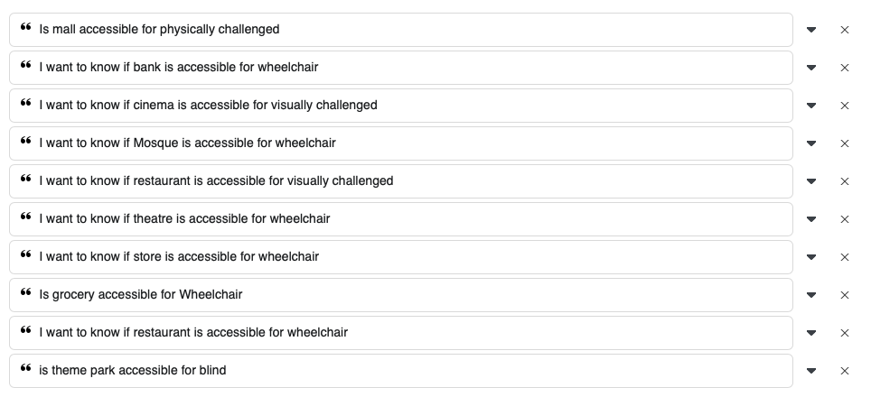
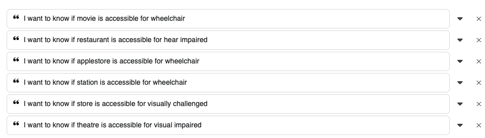

# Response for each of the Intents

APP: `https://wit.ai/v2/apps/270129564344507/`

_Input:_
# request_accessibility_info

Is theme-park accessible for visually impaired?

_Response:_
```json
{"text":"Is theme-park accessible for visually impaired?","intents":[\{"id":"622263308645974","name":"request_accessibility_info","confidence":1\}],"entities":\{"wit_disability:wit_disability":[\{"id":"705172783635479","name":"wit_disability","role":"wit_disability","start":29,"end":47,"body":"visually impaired?","confidence":0.9031,"entities":[],"suggested":true,"value":"visually impaired?","type":"value"\}],"wit$location:location":[\{"id":"257567208661149","name":"wit$location","role":"location","start":3,"end":13,"body":"theme-park","confidence":0.705,"entities":[],"suggested":true,"value":"theme-park","type":"value"\}]\},"traits":\{\}\}}
```
_Input:_
# provide_address

My location is 2765 Meyer Ave.

_Response:_
```json
{"text":"My location 2765 Meyer Ave.","intents":[{"id":"2325396274432686","name":"provide_address","confidence":0.956}],"entities":{"wit$location:location":[{"id":"257567208661149","name":"wit$location","role":"location","start":12,"end":27,"body":"2765 Meyer Ave.","confidence":0.9258,"entities":[],"suggested":true,"value":"2765 Meyer Ave.","type":"value"}]},"traits":{}}
```

_Input:_
# choosing_item

The 9th one.

_Response:_
```json
{"text":"The 9th one","intents":[{"id":"570729620252693","name":"choosing_item","confidence":0.9966}],"entities":{"wit$number:number":[{"id":"955986721487424","name":"wit$number","role":"number","start":8,"end":11,"body":"one","confidence":1,"entities":[],"type":"value","value":1}],"wit$ordinal:ordinal":[{"id":"551473445734774","name":"wit$ordinal","role":"ordinal","start":4,"end":7,"body":"9th","confidence":0.9755,"entities":[],"type":"value","value":9}]},"traits":{}}
```

_Input:_
# choosing_item

Number 5 please.

_Response:_
```json
{"text":"Number 5 please.","intents":[{"id":"570729620252693","name":"choosing_item","confidence":0.9789}],"entities":{"wit$number:number":[{"id":"955986721487424","name":"wit$number","role":"number","start":7,"end":8,"body":"5","confidence":0.9326,"entities":[],"type":"value","value":5}]},"traits":{}}
```
_Input:_
# request_direction

How can I go to The Bank of America?

_Response:_
```json
{"text":"How can I go to The Bank of America?","intents":[{"id":"1125957097782172","name":"request_direction","confidence":0.9932}],"entities":{"wit$location:location":[{"id":"257567208661149","name":"wit$location","role":"location","start":16,"end":35,"body":"The Bank of America","confidence":0.9503,"entities":[],"suggested":true,"value":"The Bank of America","type":"value"}]},"traits":{}
```

_Input:_
# request_direction

Take me to 2800 Lakehill St.

_Response:_
```json
{"text":"Take me to 2800 Lakehill St.","intents":[{"id":"1125957097782172","name":"request_direction","confidence":0.9985}],"entities":{"wit$location:location":[{"id":"257567208661149","name":"wit$location","role":"location","start":11,"end":28,"body":"2800 Lakehill St.","confidence":0.9941,"entities":[],"suggested":true,"value":"2800 Lakehill St.","type":"value"}]},"traits":{}}✔ ~ 
```

_Input:_
# request_amenities_by_disability

Are the facilities prepared to receive someone who cannot see?

_Response:_
```json
{"text":"Are the facilities prepared to receive someone who cannot see?","intents":[{"id":"700113524107424","name":"request_amenities_by_disability","confidence":0.9993}],"entities":{"wit_disability:wit_disability":[{"id":"705172783635479","name":"wit_disability","role":"wit_disability","start":51,"end":61,"body":"cannot see","confidence":0.9386,"entities":[],"suggested":true,"value":"cannot see","type":"value"}]},"traits":{}}
```

_Input:_
# request_photos

Can you show me some pics of The Grand Park?

_Response:_
```json
{"text":"Can you show me some pics of The Grand Park?","intents":[{"id":"2754036248160067","name":"request_photos","confidence":0.9933}],"entities":{"wit$location:location":[{"id":"257567208661149","name":"wit$location","role":"location","start":29,"end":43,"body":"The Grand Park","confidence":0.8528,"entities":[],"suggested":true,"value":"The Grand Park","type":"value"}]},"traits":{}}
```

_Input:_
# request_photos

Where is the bathroom located?

_Response:_
```json
{"text":"Where is the bathroom located?","intents":[{"id":"1345706348955138","name":"asking_question","confidence":0.9881}],"entities":{"wit_disability:wit_disability":[{"id":"705172783635479","name":"wit_disability","role":"wit_disability","start":22,"end":29,"body":"located","confidence":0.3823,"entities":[],"suggested":true,"value":"located","type":"value"}],"wit$location:location":[{"id":"257567208661149","name":"wit$location","role":"location","start":13,"end":21,"body":"bathroom","confidence":0.9115,"entities":[],"suggested":true,"value":"bathroom","type":"value"}]},"traits":{}}
````

##### Conversation 1


##### Conversation 2

